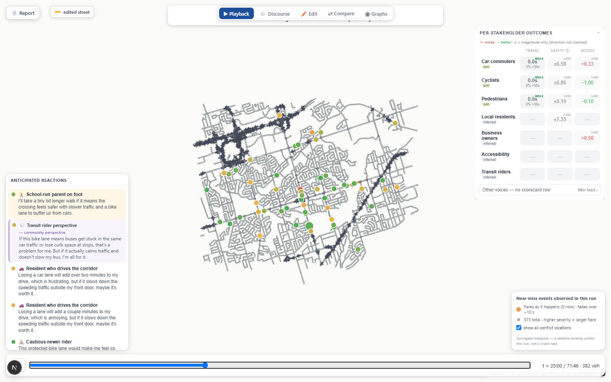
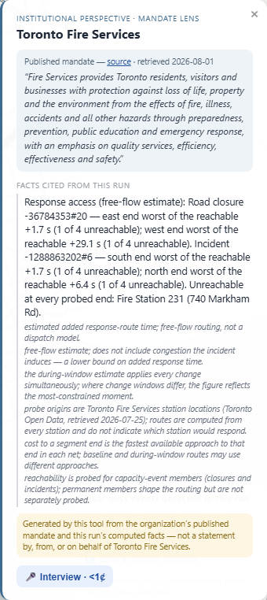
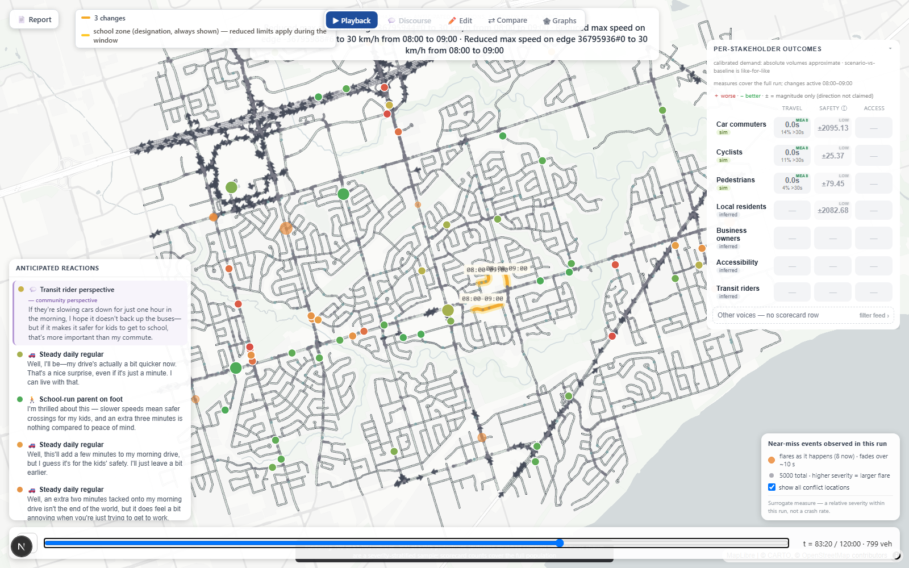
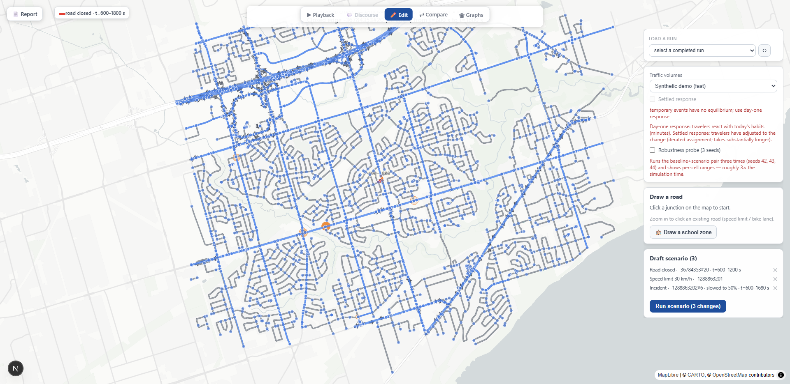
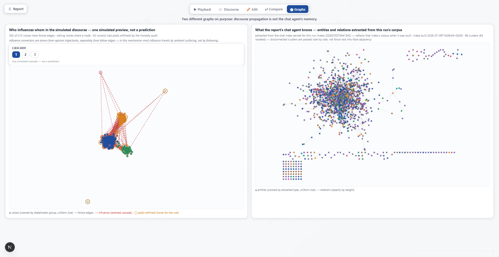

# Nadi — GTA Infrastructure Impact Simulator

Nadi lets a city planner **preview** the impact of a proposed street change — a new road, a bike
lane, a speed limit, a lane or road closure, a timed incident, a school zone — on a Toronto
corridor *before* public consultation. It couples a real SUMO traffic microsimulation with an
LLM-driven stakeholder-reaction layer: moving dots on a map, a per-stakeholder scorecard, ~212
interviewable persona voices, an audited report you can question, and a simulated-discourse view —
built so that **the tool arranges evidence and the planner concludes**, never the other way around.



**Status:** Phases 0–5 and V2.0–**V2.5** complete (tags `v2.2` … `v2.5`) · trajectory contract
**v0.9.0** · **471 pytest + 79 Playwright** tests · study corridor: Scarborough / Pickering / Ajax.
The *simulation* is bounded to one corridor, even though the framing is "the GTA."

## See it live

A **static demo** is the fastest way in — a read-only walkthrough of pre-computed runs (deploy in
flight per [DEPLOY.md](DEPLOY.md); until the link lands here, [SETUP.md](SETUP.md) runs the same
walkthrough locally in two commands). Three stops:

1. **The bare URL** — the 212-voice run: press play, click dots, open 📄 Report and 🕸 Graphs.
2. **`/?run=multimodal-scenario-20260814T063253Z`** — a 3-member composite (a road closure at a
   fire station's doorstep + a speed limit + an incident) where Toronto Fire Services' published
   mandate is read against the run's computed reachability facts.
3. **`/?run=multimodal-scenario-20260702T044134Z&compare=multimodal-scenario-20260814T063253Z`**
   — ⇄ Compare, including the provenance-mismatch guard doing its job on a mismatched pair.

Two things the demo is honest about up front. The runs are **pre-computed and real**: nothing
simulates in the browser, and these are actual SUMO runs on calibrated Toronto open data — not
mockups. And the live affordances are visibly disabled rather than clickable-then-failing, each
carrying the same sentence: *"read-only walkthrough of pre-computed runs; editing, chat, and
interviews need the local backend (SUMO + a model key) — see SETUP.md in the repo."*

## The thesis: honesty as architecture

Simulation plus LLMs is an easy way to build a very confident liar. Nadi's design premise is that
every honesty property must be **structural** — enforced by code and tests, not by prompt
etiquette. The locked decisions:

- **Preview, never verdict.** The agent layer anticipates *who wins, who loses, and what each
  objection sounds like*. It is not a referendum: no stance tallies, no sentiment averages, no
  winner, anywhere. This is test-enforced — a banned-language sweep rides **14 of the 17
  Playwright specs** plus a python-side sweep, so a regression toward "62% support" fails CI, not
  a code review.
- **No LLM per simulated vehicle.** SUMO runs *all* traffic as cheap physics; only a few hundred
  sampled persona agents reason, each pinned to a specific simulated traveler's own measured trip.
- **Safety = surrogate measures.** Near-miss measures (time-to-collision, hard braking, blocked
  junctions) computed from trajectories, rendered as ±magnitude with the direction explicitly not
  claimed — it flips across random seeds, and the tool checked. Never crash prediction.
- **A per-stakeholder scorecard, not a single number.** Travel time / safety surrogate / access,
  per group. No ROI, no aggregate.
- **Numbers carry their own caveats.** Every LLM sentence passes `audit_prose` (no digits, no
  safety direction, no tallies, no crash words — retry once, then fail loudly). The report's
  `verify_facts` recomputes every rendered figure from the artifact and enforces that required
  caveats actually ride their numbers. Scope limitations travel *in the artifact* — a windowed
  change's report says out loud that the scorecard covers the full run while the change was active
  only for its window. When something can't render, a **labeled note** says why; refusals to
  compute look different from missing data.
- **Institutions are never impersonated.** An institutional voice (Toronto Fire Services, TDSB,
  Transportation Services) is deterministic — zero LLM calls: its mission is a verbatim,
  byte-pinned quote of a sourced page with its retrieval date shown, it cites only facts this run
  computed, and no facts means no voice (the section says why it's empty).
- **Two graphs, two jobs.** The discourse-propagation graph and the report agent's memory graph
  are distinct, and the UI renders them side by side to prove it.

## Three things it computed (caveats included, as always)

**A fire station's street, closed.** A drafted 3-member composite closed the road outside Fire
Station 231 for a timed window. The response-reachability probe routes free-flow from all four
real TFS stations to *each end* of every changed segment: the east end stayed reachable at
**+1.7 s worst added time to reach** (a route survives via the street's reverse direction); the
west end's worst was **+29.1 s**; and Station 231 itself gets a per-end labeled cause — *its own
origin street is closed during the window, so no route from it is computable* — rather than being
folded into an average. The riding caveats: free-flow routing, not dispatch simulation; a lower
bound; and no claim about which station would actually respond.



**A school zone at bell time.** The 🏫 macro drops several streets to 30 km/h for 08:00–09:00
under calibrated AM-peak demand, and a zone lens counts pedestrian-vehicle crossing conflicts
near the zone in both runs: the pair came out **30 vs 28** — and the tool refuses to read it as a
direction. Two notes ride the numbers unconditionally: *"single-seed counts; at these small event
counts the difference between the two figures is within run-to-run variation and does not
establish a direction"*, and the measured population is named — *pedestrian entities from the
calibrated demand, not modeled schoolchildren*.



**The corridor saturates.** Under count-calibrated AM-peak demand (~67k travelers anchored to
Toronto traffic-count open data), inflow exceeds outflow for the whole peak window and only
**72% of demand is delivered by 09:00**. The calibration itself is reported with the same
discipline: GEH<5 on **51.8%** of 421 links — the textbook 85% is structurally unreachable on a
boundary-clipped extract, and the tool records that instead of tuning until the number flatters
it. Scenario-vs-baseline comparisons stay like-for-like regardless.

## What using it looks like

Open ✏️ Edit and *compose*: every palette action — a new road between junctions, a speed limit, a
bike lane, a lane/road closure, a timed incident — **adds a member to a draft** rather than firing
a run. Members window independently; blockers surface *before* you run, speaking the server's own
rejection strings verbatim. One **Run** submits the draft as a composite; a staged job
(baseline → scenario → analysis) fills the map in as results land. Afterwards: enrich with voices
(they stream in live), an audited report, and an OASIS discourse pass; **⧉ clone** any past run
into a fresh draft to iterate; name the runs you keep. Compare two finished runs; interview any
voice 🎤 in character — answers grounded server-side in that one agent's own recorded trip,
passing the same live honesty guard, ephemeral by construction.



## The two graphs

**Two different graphs on purpose: discourse propagation is not the chat agent's memory.** The
🕸 Graphs view renders them side by side — *who influences whom* in the simulated discourse
(uniform node size: no centrality leaderboard; colors by group, never stance; posts withheld by
the honesty audit marked with their rule on hover, never their content) versus *what the report's
chat agent knows* (the LightRAG entity graph, with its staleness relative to the run stated).



## What's real / what's not

| Real | Deliberately not |
|---|---|
| SUMO microsimulation of all traffic (cars, bikes, pedestrians) | Any crash prediction — safety is surrogate near-miss measures, direction unclaimed |
| Count-calibrated AM-peak demand from Toronto open data, provenance recorded | A verdict, recommendation, or tally — the referendum guard is test-enforced |
| Four real TFS station locations; institutional missions quoted verbatim with retrieval dates | Dispatch simulation — response numbers are free-flow lower bounds, labeled as such |
| Windowed changes applying and reverting *inside* the run, with capture/restore proof logs | Region-scale claims — the simulation is bounded to one corridor and says so |
| Persona voices pinned to their own measured trips | A poll — each voice is one individual anticipated reaction |

## Architecture — two worlds, one contract

```
┌──────────────────────────────┐    frozen trajectory contract     ┌──────────────────────────┐
│ python/  (simulation+agents) │ ─► contract/trajectory_schema.json ─► web/  (frontend)        │
│ SUMO · staged harness ·      │    (JSON Schema + pydantic + TS)  │  Next.js · deck.gl ·      │
│ scorecard · voices · report+ │           v0.9.0, versioned       │  MapLibre                 │
│ chat (LightRAG) · OASIS ·    │                                   └────────────┬─────────────┘
│ institutions · graph layouts │   web/public/latest.json = a POINTER           │
└──────────────┬───────────────┘   {"run_id"} written only on quant completion; │
               │                   per-run artifacts load by id                 │
               │      FastAPI job-runner (server.py, :8000)                     │
               └─  /api/simulate · /api/runs · …/enrich/stream · …/identity ·  ─┘
                  /api/report · /api/chat · /api/interview
```

The boundary is a **frozen contract**: changing its schema means bumping the version and updating
both sides, and a hook guards the directory. Since v0.5.0 a scenario is a *list* of changes (+
tags); v0.9.0 added mandate-grounded institutional agents.

```
python/src/
  scenario_harness.py     # staged baseline+scenario pairs, outcome join, seed probes
  server.py               # FastAPI job-runner fronting the whole pipeline
  change_scheduler.py     # windowed apply/revert in-sim + proof logs; closures; incidents
  scorecard.py            # 7-group scorecard + honesty metadata + cross-seed ranges
  sampler.py / reactions.py                 # pin travelers → voice them (provider-agnostic LLM)
  report.py / report_agent.py               # audited 5-section report + per-run LightRAG chat
  interview.py / institutions.py            # in-character interviews · the mandate-lens roster
  response_probe.py       # per-end response reachability (4 real TFS stations, free-flow)
  zone_lens.py / propagation.py / graph_export.py   # school-zone lens · OASIS · graph layouts
web/                      # Next.js + deck.gl/MapLibre; the exported network IS the base layer
contract/                 # trajectory_schema.json (v0.9.0) + runs/
data/                     # counts / demand / schools — open-data provenance records
scripts/                  # build-static-demo.mjs · perf-harness.mjs (measured frame budgets)
```

## Run it yourself

Full local setup — SUMO 1.27, the python envs, keys per optional layer — lives in
**[SETUP.md](SETUP.md)**. The short version:

```bash
cd python/src && uvicorn server:app --port 8000   # the job-runner API
cd web && npm run dev                              # → http://localhost:3000 → ✏️ Edit
```

The quant pipeline (simulate → scorecard) needs **no keys**; each enrich layer (voices, report +
chat + interviews, discourse) unlocks with one. The repo ships two complete pre-computed runs, so
the map renders before you ever run SUMO.

```bash
python -m pytest python/tests        # 471 tests
cd web && npx playwright test        # 79 tests, 17 specs
```

## History

- **Phases 0–5 ✅** — spine → scenario+voices → scorecard/multimodal → audited report + chat →
  OASIS discourse → the editor (the server fronts the pipeline).
- **V2.0–V2.1 ✅** — multi-change contract; the network as the base layer; count-calibrated
  demand; settled assignment (day-one **+5.05 s** vs settled **+2.31 s** on the same change —
  adaptation absorbs about half the shock); seed ranges; ⇄ Compare.
- **V2.2 ✅ (`v2.2`)** — windowed changes with in-sim revert proofs, closures, incidents, the
  response probe, the school zone, the windowed-scope disclosure.
- **V2.3 ✅ (`v2.3`)** — streamed enrich, persona interviews, mandate-grounded institutions
  (contract v0.9.0), the graph split-view.
- **V2.4 ✅ (`v2.4`)** — scenario composition: the draft basket, mixed-type composites, clone-to-
  draft, run identity.
- **V2.5 ✅ (`v2.5`)** — the presentable core: disclosure debts paid, **per-end response
  reachability** (the fire-station fact above), the `latest.json` pointer split + the first
  measured frame budgets, the static demo, this README.
- **Open** — [BACKLOG.md](BACKLOG.md): bbox expansion + signal rebuild (a larger net is what
  changes the saturation finding), network styling (V2.7), a real student-demand segment,
  periodic mandate re-verification, contract payload thinning.

**Stack:** SUMO 1.27 (TraCI) · FastAPI · a provider-agnostic LLM layer (DeepSeek for the
report/agent spine, Groq for voices) · LightRAG + local MiniLM embeddings · OASIS/CAMEL ·
networkx · Next.js · React · TypeScript · deck.gl · MapLibre.

For developers: `CLAUDE.md` is the full per-phase engineering record; `BACKLOG.md` holds every
deferred thread with its honesty notes.

---

*Nadi is a stakeholder-reaction **preview**: it anticipates who wins, who loses, and the texture
of each objection. It is not a referendum, a recommendation, or a crash predictor, and its
simulation is bounded to a single corridor.*
