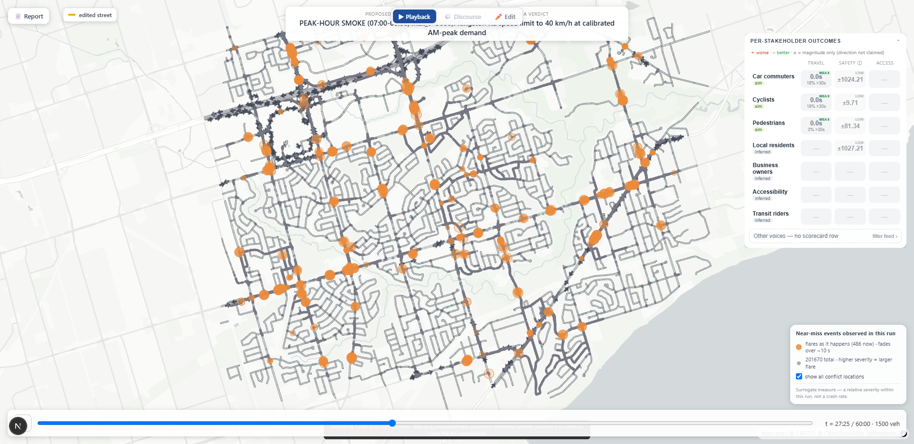

# Nadi — GTA Infrastructure Impact Simulator

> Preview the impact of a proposed infrastructure change — a new road, bike lane, speed limit,
> lane/road closure, incident, or school zone — on a Toronto corridor **before** public consultation.
> Nadi couples a SUMO traffic microsimulation with an LLM-driven stakeholder-reaction layer, shown as
> moving dots on a map with a per-stakeholder scorecard, a credibility-first report you can query, a
> simulated public-discourse view — and now interviewable voices, mandate-grounded institutional
> perspectives, and the tool's two graphs rendered side by side.



**Status:** Phases 0–5 and V2.0–**V2.3** complete (tags `v2.2`, `v2.3a`, `v2.3`) · Trajectory contract
**v0.9.0** · Suites **419 pytest + 53 Playwright (14 specs)** · Study corridor: **Scarborough /
Pickering / Ajax** · The *simulation* is bounded to one corridor/neighborhood, even though the framing
is "the GTA."

It answers a planner's real question — *who wins, who loses, and what does each objection sound like?* —
as an **anticipation**, never a verdict.

---

## What it does

Open the map, hit **✏️ Edit**, and draw the change: a new road between two junctions, a speed limit or
bike lane on an existing street, a lane or road closure, a timed incident, or a **🏫 school zone** —
several streets dropped to 30 km/h during school hours as one composite scenario. The server runs the
whole pipeline as a staged job and the map fills in as results land.

The pipeline, end to end:

1. **Simulate** — SUMO runs **all** traffic (cars, bikes, pedestrians) as cheap physics — no LLM per
   vehicle. Demand is either the synthetic demo set or a **count-calibrated AM peak** (~67k travelers
   anchored to Toronto's traffic-count open data, t=0 == 07:00). Windowed changes apply at their start
   time and revert at their end *inside* the run, with a capture/restore proof log.
2. **Compare** — a baseline-vs-scenario pair with identical demand and seeds; outcomes joined
   per traveler (Δ travel time, Δ delay, non-completions with causally-neutral accounting). Optional:
   **settled assignment** (iterated routes — "after drivers adapt") and **1–3 seeds**, with per-cell
   ranges so a sign that flips across seeds is never rendered as a direction.
3. **Score** — a per-stakeholder **scorecard** (7 groups × travel time / safety / access) with honesty
   metadata on every cell: measured vs low-confidence, safety as ±magnitude only (direction never
   claimed), notes that ride the artifact. Safety comes from **surrogate near-miss measures**
   (TTC/PET/hard-braking + a pedestrian-crossing pass) — never crash prediction. Capacity changes add
   first-class facts: diverted counts, non-completions, and a free-flow **emergency-response detour**
   estimate from four real Toronto Fire Services stations (labeled as routing, never dispatch).
4. **React** — ~212 persona **voices**: vehicle- and pedestrian-pinned agents react to *their own
   measured trip*, plus inferred community voices (business owners, residents) with no trajectory —
   each an individual anticipated reaction, never a poll. Voices **stream in as they generate**
   (server-sent events; a dead stream degrades to polling with a visible label, never silently). A
   tagged school zone gets one mechanical preface; parents advocate from their own outcomes —
   children are never ventriloquized.
5. **Report & explore** — everything assembles into a versioned artifact and plays back in the
   browser: sentiment-colored dots, a live comment feed keyed to each traveler's worst moment,
   time-true overlays (a windowed closure disappears from the map when it reverts). On top of that:
   a **5-section report** where the LLM fills only narrative slots (all numbers code-rendered, then
   audited: no digits, no safety direction, no vote tallies, no crash words), an **"ask the report"
   chat** over a per-run LightRAG index that cites its sources and refuses honestly, an **OASIS
   discourse view** (opinion cascades over a social graph — illustrative texture, never a forecast),
   and a **⇄ Compare** mode for two runs with a provenance-mismatch guard and delta cells that refuse
   arithmetic wherever a direction isn't claimable.
6. **Meet the agents** (V2.3) — click 🎤 on any voice and **interview it in character**: answers are
   grounded server-side in that one agent's own recorded trip, pass the same live honesty guard as
   the report, deflect referendum questions in character, and are ephemeral (nothing written).
   **🏛 Institutional perspectives** speak through a mandate lens: a small roster (Toronto Fire
   Services, TDSB, Transportation Services) whose published missions are quoted **verbatim from
   sourced pages** (never LLM-touched, retrieval date shown) and who cite only facts this run
   computed — no facts, no voice, and the section says why it's empty. And the **🕸 Graphs**
   split-view finally renders the tool's two graphs side by side — *who influences whom in the
   simulated discourse* vs *what the report's chat agent knows* — with posts withheld by the honesty
   audit marked on the graph (the rule on hover, never the content) and no centrality leaderboard
   anywhere.


## Design principles (the guardrails)

These are locked decisions — they're what keep the tool honest:

- **Preview, not verdict.** The agent layer previews *who wins, who loses, and the texture of each
  objection*. It is not a referendum, an oracle, or a recommendation. No stance tallies, no sentiment
  averages, no winner — anywhere.
- **No LLM per simulated vehicle.** SUMO simulates all traffic as physics; only a few hundred sampled
  persona agents reason, each pinned to a specific simulated traveler.
- **Safety = surrogate measures.** Time-to-collision, hard braking, blocked junctions — computed from
  trajectories, rendered as ±magnitude with the direction explicitly not claimed (it flips across
  seeds). Nadi **never** claims crash prediction.
- **Per-stakeholder scorecard, not a single ROI.** Travel time / safety surrogate / access, *per
  group* — not one number.
- **Numbers carry their own caveats.** What a number means rides the artifact (confidence, notes,
  seed ranges, population disclosures like "pedestrian entities from the calibrated demand — not
  modeled schoolchildren"), never just a docstring. Refusals to compute look different from absence.
  On a windowed run, the **scope disclosure** says both scopes out loud — scorecard measures cover
  the whole simulated period; the change was active for only its window of it — in the report, its
  caveats, the chat corpus, and the scorecard panel.
- **Institutions are never impersonated.** An institutional voice is mandate-grounded and
  facts-gated: its mission is a verbatim, byte-pinned quote of a sourced page, it cites only
  computed facts with their honesty sentences attached, it is deterministic (zero LLM calls), and
  every rendering carries the disclaimer that these are not statements by the named organizations.
  No facts → no voice.
- **Two graphs, two jobs.** The OASIS social graph (opinion propagation) and the report agent's
  GraphRAG memory are distinct and never conflated — and since V2.3d they render side by side,
  visibly different, each panel stating its job.
- **Playback, not stream-live.** Run the physics, run the agent pass batched, then replay. (The
  enrich *progress* streams; the artifact is byte-identical either way.)
- **Reuse libraries.** The custom work is the *glue* (SUMO↔web, edit↔network-regen) — not rebuilding
  what SUMO / deck.gl / OASIS / LightRAG already do.

## Architecture — two worlds, one contract

```
┌──────────────────────────────┐      frozen trajectory contract      ┌──────────────────────────┐
│ python/  (simulation+agents) │  ──►  contract/trajectory_schema.json ──►  web/  (frontend)      │
│ SUMO · scorecard · voices ·  │       (JSON Schema + pydantic + TS)   │  Next.js · deck.gl ·     │
│ report+chat · OASIS ·        │              v0.9.0, versioned        │  MapLibre                │
│ institutions · graph layouts │                                      └────────────┬─────────────┘
└──────────────┬───────────────┘                                                   │
               │        FastAPI job-runner (server.py, :8000)                      │
               └─  /api/simulate · /api/runs · /api/runs/<id>/enrich/stream ·  ────┘
                  /api/report · /api/chat · /api/interview
```

- **`python/`** — simulation + agents: SUMO via TraCI, the staged harness, scorecard, the
  provider-agnostic LLM layer, the report + LightRAG chat, persona interviews, the institutions
  roster, OASIS propagation (own conda env), and the graph-layout exporter.
- **`web/`** — Next.js + React + TypeScript; deck.gl over MapLibre renders the exported network
  itself as the base layer (4,570 edges — the drawn roads ARE the simulation's roads).
- **`contract/`** — the boundary is a **frozen trajectory contract**. Changing its schema means
  bumping the version and updating *both* sides; a hook guards it. Since v0.5.0 a scenario is a
  **list of changes** (+ optional tags); v0.9.0 added mandate-grounded institutional agents.

## Repo layout

```
python/src/
  run_sim.py              # Phase-0 spine: SUMO run → trajectory artifact
  scenario_harness.py     # staged baseline+scenario pairs, outcome join, seed probes, CLI
  server.py               # FastAPI job-runner: /api/simulate /runs /edges /report /chat /interview
  change_scheduler.py     # windowed changes: apply/revert in-sim + proof log; closures; incidents
  scorecard.py            # 7-group scorecard + honesty metadata + cross-seed ranges
  sampler.py / personas.py / reactions.py   # pin travelers → voice them (provider-agnostic LLM)
  report.py / report_agent.py               # audited 5-section report + per-run LightRAG chat
  interview.py            # in-character persona interviews (server-built grounding, live guard)
  institutions.py/.json   # the mandate-grounded roster: verbatim missions, facts gating, citations
  propagation.py          # OASIS discourse cascades (separate `oasis` conda env)
  graph_export.py         # the two graphs' layouts (networkx server-side, positions-only sidecar)
  enrich_events.py        # the SSE enrich-progress channel (env-gated; CLI stays byte-identical)
  response_probe.py       # emergency-response detour fact (4 real TFS stations, free-flow routing)
  zone_lens.py            # school-zone ped-vehicle conflict pair (tag-gated, caveats built in)
  network_edit.py / network_export.py       # netconvert patches + the web base-layer export
  demand_profiles.py / demand_calibration.py / settle.py   # demand registry · calibration · settled
contract/                 # trajectory_schema.json (v0.9.0) + gitignored runs/
data/                     # counts / demand / schools — open-data provenance + calibration records
web/
  components/             # MapView, EditPanel+palettes, ScorecardPanel, CompareView,
                          # GraphSplitView, InstitutionPanel, InterviewDrawer, …
  lib/                    # types, loaders, compare logic, sim-time formatting, enrich stream
  tests/                  # 53 Playwright tests across 14 specs
python/tests/             # 419 pytest tests (golden spine, contract gates, honesty invariants)
```

## Quickstart

**Prerequisites**
- [SUMO](https://eclipse.dev/sumo/) 1.27 (set `SUMO_HOME`; not on PATH on Windows)
- Python (miniconda): `pydantic`, `jsonschema`, `fastapi`, `uvicorn`, `networkx`, plus
  `python/requirements-agent.txt` for the report/chat spine
- Node.js for `web/`
- Keys in `python/.env` (gitignored): `DEEPSEEK_API_KEY` (report + agent pipeline pins DeepSeek),
  `GROQ_API_KEY` (reaction layer default)

> **Fresh-clone note:** built SUMO networks (`*.net.xml`) are gitignored — regenerate
> `python/scenario/corridor.net.xml` with `netconvert` from the tracked OSM extract
> (`python/scenario/corridor_bbox.osm.xml`) before anything simulates, then rerun
> `python python/src/network_export.py` so the web base layer matches.

**The primary flow — the editor:**

```bash
export SUMO_HOME="/c/Program Files (x86)/Eclipse/Sumo"   # per session
cd python/src && uvicorn server:app --port 8000           # the job-runner API
cd web && npm run dev                                     # → http://localhost:3000 → ✏️ Edit
```

Draw a change, pick run options (demand profile, day-one vs settled, seeds), Simulate — the RunCard
tracks the staged run; then enrich with voices / report / discourse from the same card (voices tick
in live). Compare two finished runs via ⇄ Compare or `/?run=<A>&compare=<B>`; open 🕸 Graphs on any
enriched run; click 🎤 on a voice to interview it.

**Tests**

```bash
python -m pytest python/tests        # 419 tests
cd web && npx playwright test        # 53 tests, 14 specs
```

## Roadmap

- **Phase 0 — ✅ Spine.** Corridor → SUMO → frozen artifact → moving dots + timeline.
- **Phase 1 — ✅ Scenario + agents.** Baseline-vs-scenario, outcome join, ~12 voices, reactive map.
- **Phase 2 — ✅ Scorecard + multimodal.** Bikes/peds, conflicts, the 7-group scorecard, 212 voices.
- **Phase 3 — ✅ Report + chat.** Audited report; per-run LightRAG "ask the report".
- **Phase 4 — ✅ Discourse.** OASIS opinion cascades over the voices (the second graph).
- **Phase 5 — ✅ The editor.** The server fronts the pipeline; draw-a-road + edit-an-edge.
- **V2.0 — ✅** Contract v0.5.0 (multi-change scenarios) + the network itself as the base map layer.
- **V2.1 — ✅** Count-calibrated AM-peak demand, settled assignment, seed ranges, ⇄ Compare.
- **V2.2 — ✅ (tagged `v2.2`)** Windowed changes with in-sim revert proofs, lane/road closures,
  incidents, the response-detour fact, the full editor palette, and the **school zone** — the first
  real composite, accepted synthetically and landed on a calibrated run (zone conflict pair 30-vs-28,
  direction deliberately not claimed at that n). Closed out with the **windowed-scope disclosure**.
- **V2.3 — ✅ (tagged `v2.3`)** The agent-experience layer: **SSE-streamed enrich** (voices render as
  they generate; labeled degradation, byte-identical artifacts), **persona interviews** (in
  character, own-outcomes-only, live-guarded, referendum questions deflected, ephemeral),
  **mandate-grounded institutional stakeholders** (contract v0.9.0 — verbatim sourced missions,
  facts-gated, deterministic; the fire service speaking a real computed detour was the phase's
  headline), and the **graph split-view** — the OASIS social graph and the report's GraphRAG entity
  graph side by side, exclusions visible with their audit rules, no influence leaderboard.
- **Next — V2.5** network styling over the functional-plain base layer.
- **Further** — `BACKLOG.md`: the bbox-expansion + signal-plan rebuild (the pace probe measured the
  boundary-clipped corridor **saturating** under calibrated AM peak — inflow > outflow all window,
  72% of demand delivered by 09:00 — a larger net is what changes that), the rung-2 along-edge
  detour refinement, a real student-demand segment, periodic mandate re-verification.

## Tech stack

SUMO 1.27 (TraCI) · FastAPI · provider-agnostic LLM layer (DeepSeek for report/agents, Groq default
for reactions; Gemini/OpenAI-compatible adapters) · LightRAG + local MiniLM embeddings · OASIS/CAMEL
(separate conda env) · networkx (graph layouts) · Next.js · React · TypeScript · deck.gl · MapLibre.
Two graphs, kept distinct: the OASIS social graph (opinion propagation) and GraphRAG (the report
agent's memory).

---

*Nadi is a stakeholder-reaction **preview**: it anticipates who wins, who loses, and the texture of
each objection. It is not a referendum, a recommendation, or a crash predictor, and its simulation is
bounded to a single corridor.*
